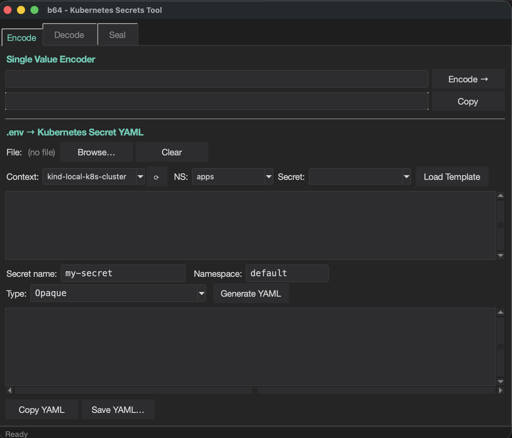
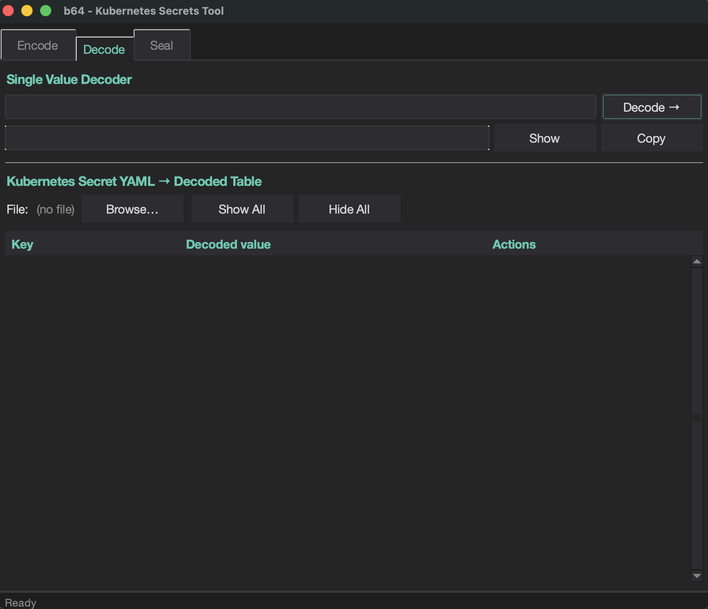
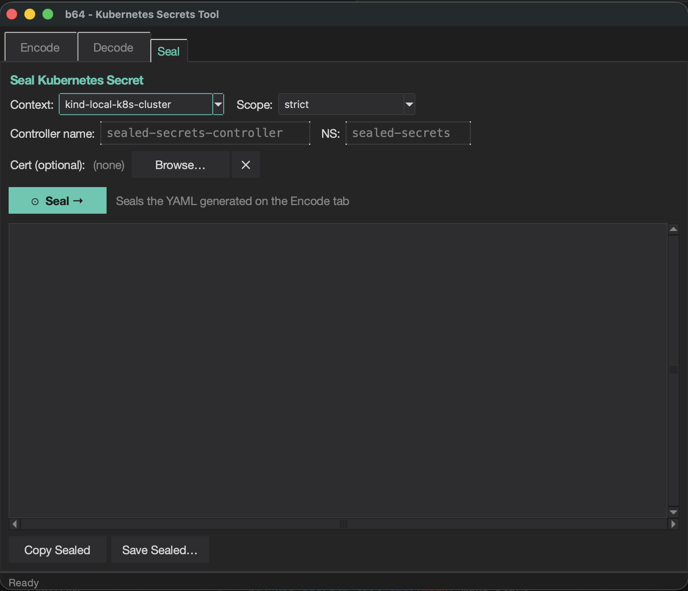

# b64 — Kubernetes Secrets Tool

A dark-themed Tkinter GUI for working with Kubernetes secrets: encode/decode
base64, build Secret YAML from a `.env` file, fetch existing secrets from a
cluster (read-only), and seal them with `kubeseal`.

> **Read-only against the cluster.** The tool never runs `kubectl apply`,
> `create`, `patch`, or `delete`. It only *reads* (contexts, namespaces,
> secrets) and produces YAML locally.

## Screenshots

| Encode | Decode | Seal |
|:---:|:---:|:---:|
|  |  |  |
| Encode a single value or load a `.env` file, fetch a secret from the cluster, and generate Kubernetes Secret YAML. | Decode a single base64 value or load a Secret YAML file to view all keys in a masked, per-row table with Show/Hide and Copy. | Seal the generated YAML with `kubeseal` — auto-detects the controller name and namespace; supports strict, namespace-wide, and cluster-wide scopes. |

## Features

- **Encode tab**
  - Single-value base64 encoder
  - `.env` → Kubernetes Secret YAML: load a `.env` file or fetch an existing
    secret from a cluster, edit the `KEY=value` pairs, then generate, copy, or
    save the Secret YAML
  - Secret **type** selector (`Opaque`, `bootstrap.kubernetes.io/token`,
    `kubernetes.io/tls`, …) — pick a built-in type or enter a custom one;
    while it is left at `Opaque`, the type is auto-detected from the keys
    (e.g. `tls.crt` + `tls.key` → `kubernetes.io/tls`)
  - **Load Template** pulls a secret from the cluster and decodes it into the
    editor — also pre-filling the editable Secret name / Namespace / Type fields
- **Decode tab**
  - Single-value base64 decoder with masked output + Show/Hide
  - Secret YAML → decoded table: per-row Show/Hide and Copy, plus Show All / Hide All
- **Seal tab**
  - Seals the YAML from the Encode tab with `kubeseal`
  - Context + scope (`strict` / `namespace-wide` / `cluster-wide`) and an
    optional cert file
- All `kubectl` / `kubeseal` calls run on background threads, so the UI never blocks.

## Requirements

- macOS with [Homebrew](https://brew.sh), or Debian/Ubuntu Linux (incl. WSL) with `apt`
- `kubectl` and `kubeseal` on your `PATH` (for the cluster-fetch and seal features)
- A modern Tcl/Tk — see the note below

> **Why a Homebrew Python?** macOS ships a deprecated **system Tk 8.5** that
> renders custom widget colours incorrectly (invisible labels, blank panels).
> The `Makefile` builds a virtualenv from a Homebrew Python linked against
> **Tcl/Tk 9**, so the dark theme renders correctly. Running the app with the
> plain `/usr/bin/python3` will look broken — always launch via `make`.

## Quick start

Fresh machine — install the modern Tk, create the venv, install deps:

```bash
make bootstrap
```

Then run it:

```bash
make start
```

## Usage

| Command | Action |
|---|---|
| `make bootstrap` | Full fresh-install setup (Homebrew Tk + venv + deps) |
| `make setup`     | Create the venv and install Python deps (idempotent) |
| `make start`     | Launch the app in the background |
| `make stop`      | Stop the running app |
| `make restart`   | Stop, then start |
| `make status`    | Show whether the app is running |
| `make clean`     | Stop and remove the venv, cache, and pidfile |

The app runs detached in the background; closing the terminal won't stop it —
use `make stop`. The running process ID is tracked in `.app.pid`.

## Project layout

```
app.py        the application (single file)
Makefile      setup / start / stop / status
README.md     this file
.venv/        virtualenv with Tcl/Tk 9 + PyYAML (created by make)
```

## Releases

**Every pull request merged into `main` cuts a release.** The version bump
defaults to **patch**; add a label to bump higher, or skip the release:

| Label | Bump | Example |
|---|---|---|
| _(none)_ | patch | `v1.2.3` → `v1.2.4` |
| `release:minor` | minor | `v1.2.3` → `v1.3.0` |
| `release:major` | major | `v1.2.3` → `v2.0.0` |
| `release:skip` | _no release_ | — |

The workflow computes the next version from the latest tag, then creates the
tag and a GitHub release with auto-generated notes.
